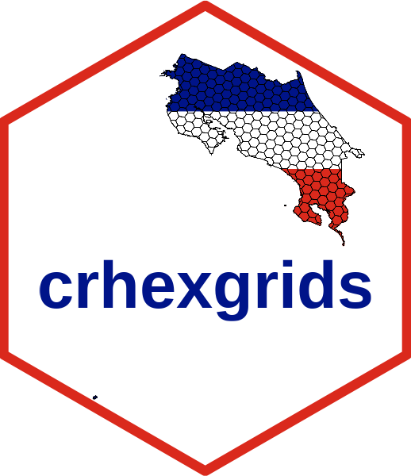
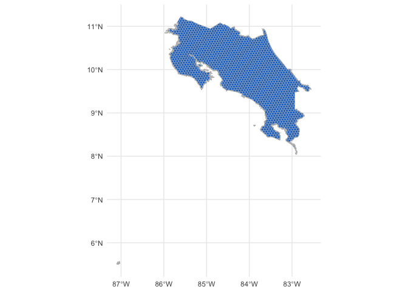
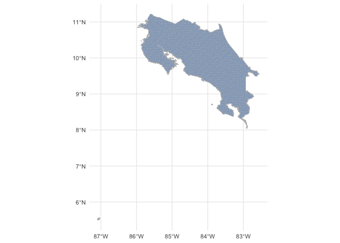
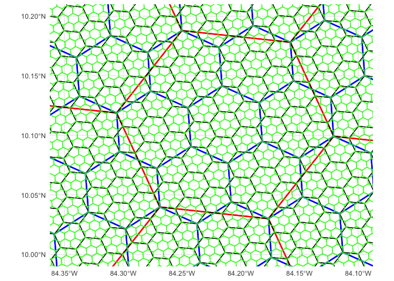

crhexgrids: hierarchical hexagonal geospatial grids for Costa Rica
================

<!-- README.md is generated from README.Rmd. Please edit that file -->

# crhexgrids 

<!-- badges: start -->
<!-- badges: end -->

The goal of crhexgrids is to provides a hierarchical geospatial
hexagonal grid indexing system for Costa Rica

Hexagonal grid resolution are 5, 6, 7, 8 y 9 (based in
[H3](https://h3geo.org))

## Installation

You can install the development version of crhexgrids from
[GitHub](https://github.com/) with:

``` r
# install.packages("devtools")
devtools::install_github("ManuelSpinola/crhexgrids")
```

## Example

This is a basic example which shows you how to use crhexgrids:

``` r
library(tidyverse)
library(sf)
library(crhexgrids)
```

``` r
ggplot(cr_hex_grid_res_5) +
  geom_sf(fill = "dodgerblue3", color = "gray") +
  theme_minimal()
```

<div class="figure">


<p class="caption">
Figura 1. Hexagonal grid of resolution 5 for Costa Rica.
</p>

</div>

<br>

``` r
ggplot(cr_hex_grid_res_6) +
  geom_sf(fill = "dodgerblue3", color = "gray") +
  theme_minimal()
```

<div class="figure">


<p class="caption">
Figura 2. Hexagonal grid of resolution 6 for Costa Rica.
</p>

</div>

<br>

``` r
ggplot(cr_hex_grid_res_7) +
  geom_sf(fill = "dodgerblue3", color = "gray") +
  theme_minimal()
```

<div class="figure">


<p class="caption">
Figura 3. Hexagonal grid of resolution 7 for Costa Rica.
</p>

</div>

<br>

<div class="figure">


<p class="caption">
Figura 4. Hierarchical hexagonal grids of resolution 5, 6, 7, 8. Every
hexagonal cell has seven child cells below it in this hierarchy.
</p>

</div>
